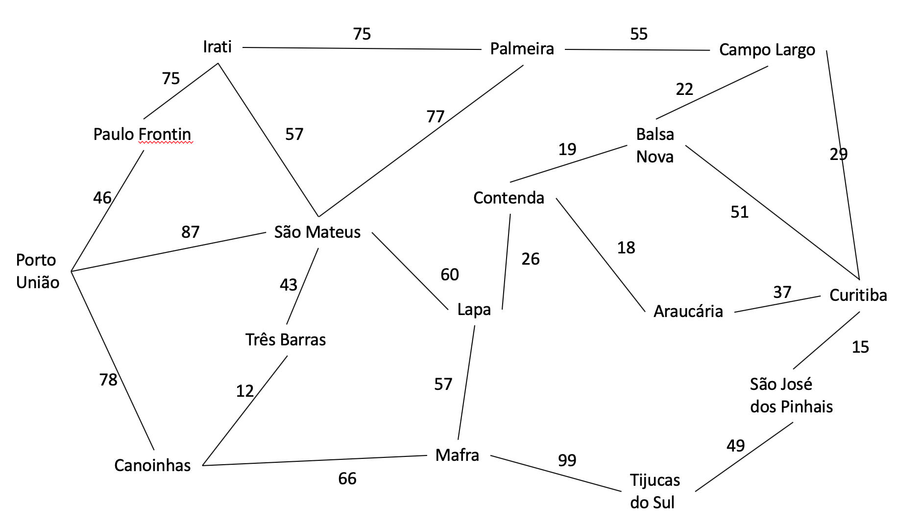

# Sistema de Busca A* em Python 🌟

Este notebook implementa um sistema de busca no modelo A*, programado em Python. O objetivo do algoritmo é encontrar o caminho mais vantajoso até a cidade de **Curitiba**, partindo da cidade **Porto União**. Pense em um sistema de navegação 🚗.

## Descrição 🔎

O projeto consiste em um sistema de busca no modelo A*, programado em Python. O código busca encontrar o caminho mais vantajoso até a cidade de Curitiba, partindo da cidade Porto União. Outras cidades podem ser usadas no sistema, porém o código possui limitações. O mapa das cidades e suas distâncias está contido na pasta para melhor visualização e entendimento.

## Instalação ⚒️

Para executar o notebook, você precisará do Python 3 instalado e da biblioteca `numpy`. Use o comando abaixo para instalar `numpy`:

```python
!pip install numpy
```

## Código 🔢
Definição dos Vértices e Adjacentes
Cada cidade é representada por um vértice com uma distância objetiva até Curitiba. Adjacências entre as cidades são definidas com seus respectivos custos:

```python
import numpy as np

class Vertice:
    def __init__ (self, nome, distancia):
        self.nome = nome
        self.distancia_objetivo = distancia
        self.visitado = False
        self.adjacentes = []

    def add_adjacente(self, adjacente):
        self.adjacentes.append(adjacente)

    def show_adjacente(self):
        for i in self.adjacentes:
            print(i.vertice.nome, i.custo)

class adjacente:
    def __init__ (self, Vertice, custo):
        self.vertice = Vertice
        self.custo = custo
        self.distancia_aestrela = Vertice.distancia_objetivo + self.custo
```
## Definição do Grafo
O grafo é composto pelas cidades e suas respectivas adjacências:
```python
class Grafo:
    portouniao = Vertice("Porto União", 203)
    paulofrontin = Vertice("Paulo Frontin", 172)
    canoinhas = Vertice("Canoinhas", 141)
    tresbarras = Vertice("Três Barras", 131)
    saomatdosul = Vertice("São Mateus do Sul", 123)
    irati = Vertice("Irati", 139)
    curitiba = Vertice("Curitiba", 0)
    palmeira = Vertice("Palmeira", 59)
    mafra = Vertice("Mafra", 94)
    campolargo = Vertice("Campo Largo", 27)
    balsanova = Vertice("Balsa Nova", 41)
    lapa = Vertice("Lapa", 74)
    tijucadosul = Vertice("Tijuca do Sul", 56)
    araucaria = Vertice("Araucária", 23)
    saojosepinhais = Vertice("São José dos Pinhais", 13)
    contenda = Vertice("Contenda", 39)

    portouniao.add_adjacente(adjacente(canoinhas,78))
    portouniao.add_adjacente(adjacente(paulofrontin,46))
    portouniao.add_adjacente(adjacente(saomatdosul,87))

    canoinhas.add_adjacente(adjacente(tresbarras,12))
    canoinhas.add_adjacente(adjacente(mafra,66))
    canoinhas.add_adjacente(adjacente(portouniao,78))

    paulofrontin.add_adjacente(adjacente(irati,75))
    paulofrontin.add_adjacente(adjacente(portouniao,46))

    tresbarras.add_adjacente(adjacente(canoinhas,12))
    tresbarras.add_adjacente(adjacente(saomatdosul,43))

    irati.add_adjacente(adjacente(saomatdosul,57))
    irati.add_adjacente(adjacente(palmeira,75))
    irati.add_adjacente(adjacente(paulofrontin,75))

    saomatdosul.add_adjacente(adjacente(tresbarras,43))
    saomatdosul.add_adjacente(adjacente(irati,57))
    saomatdosul.add_adjacente(adjacente(portouniao,87))
    saomatdosul.add_adjacente(adjacente(palmeira,77))
    saomatdosul.add_adjacente(adjacente(lapa,60))

    lapa.add_adjacente(adjacente(saomatdosul,60))
    lapa.add_adjacente(adjacente(mafra,57))
    lapa.add_adjacente(adjacente(contenda,26))

    mafra.add_adjacente(adjacente(canoinhas,66))
    mafra.add_adjacente(adjacente(lapa,57))
    mafra.add_adjacente(adjacente(tijucadosul,99))

    palmeira.add_adjacente(adjacente(irati,75))
    palmeira.add_adjacente(adjacente(campolargo,55))
    palmeira.add_adjacente(adjacente(saomatdosul,77))

    contenda.add_adjacente(adjacente(lapa,26))
    contenda.add_adjacente(adjacente(balsanova,19))
    contenda.add_adjacente(adjacente(araucaria,18))

    balsanova.add_adjacente(adjacente(contenda,19))
    balsanova.add_adjacente(adjacente(campolargo,22))
    balsanova.add_adjacente(adjacente(curitiba,51))

    araucaria.add_adjacente(adjacente(curitiba,37))
    araucaria.add_adjacente(adjacente(contenda,18))

    saojosepinhais.add_adjacente(adjacente(curitiba,15))
    saojosepinhais.add_adjacente(adjacente(tijucadosul,19))

    tijucadosul.add_adjacente(adjacente(saojosepinhais,19))
    tijucadosul.add_adjacente(adjacente(mafra,99))

    campolargo.add_adjacente(adjacente(balsanova,22))
    campolargo.add_adjacente(adjacente(curitiba,29))
```

## Implementação do Vetor Ordenado
O vetor ordenado é utilizado para armazenar e ordenar os vértices adjacentes com base na distância A*:
```python
class VetorOrdenado:
    def __init__(self, capacidade):
        self.capacidade = capacidade
        self.ultima_posicao = -1
        self.valores = np.empty(self.capacidade, dtype=object)

    def insere(self, adjacente):
        if self.ultima_posicao == self.capacidade - 1:
            print('Capacidade máxima atingida')
            return
        posicao = 0
        for i in range(self.ultima_posicao + 1):
            posicao = i
            if self.valores[i].distancia_aestrela > adjacente.distancia_aestrela:
                break
            if i == self.ultima_posicao:
                posicao = i + 1
        x = self.ultima_posicao
        while x >= posicao:
            self.valores[x + 1] = self.valores[x]
            x -= 1
        self.valores[posicao] = adjacente
        self.ultima_posicao += 1

    def imprime(self):
        if self.ultima_posicao == -1:
            print('O vetor está vazio')
        else:
            for i in range(self.ultima_posicao + 1):
                print(i, ' - ', self.valores[i].vertice.nome, ' - ', self.valores[i].custo, ' - ', self.valores[i].vertice.distancia_objetivo, ' - ', self.valores[i].distancia_aestrela)
```
## Implementação da Busca A*
A busca A* é realizada através da classe AEstrela, que encontra o caminho mais curto para o objetivo:
```python
class AEstrela:
    def __init__(self, objetivo):
        self.objetivo = objetivo
        self.encontrado = False

    def buscar(self, atual):
        print('------------------')
        print('Atual: {}'.format(atual.nome))
        atual.visitado = True

        if atual == self.objetivo:
            self.encontrado = True
        else:
            vetor_ordenado = VetorOrdenado(len(atual.adjacentes))
            for adjacente in atual.adjacentes:
                if adjacente.vertice.visitado == False:
                    adjacente.vertice.visitado = True
                    vetor_ordenado.insere(adjacente)
            vetor_ordenado.imprime()

            if vetor_ordenado.valores[0] != None:
                self.buscar(vetor_ordenado.valores[0].vertice)
```

## Execução da Busca A*
Para executar a busca, inicialize a classe AEstrela com o objetivo e a cidade atual:

```python
grafo = Grafo()
busca_aestrela = AEstrela(grafo.curitiba) # CIDADE DESTINO
busca_aestrela.buscar(grafo.portouniao) # CIDADE ATUAL
```
Resultado 🤩:
```
------------------
Atual: Porto União
0  -  São Mateus do Sul  -  87  -  123  -  210
1  -  Paulo Frontin  -  46  -  172  -  218
2  -  Canoinhas  -  78  -  141  -  219
------------------
Atual: São Mateus do Sul
0  -  Lapa  -  60  -  74  -  134
1  -  Palmeira  -  77  -  59  -  136
2  -  Três Barras  -  43  -  131  -  174
3  -  Irati  -  57  -  139  -  196
------------------
Atual: Lapa
0  -  Contenda  -  26  -  39  -  65
1  -  Mafra  -  57  -  94  -  151
------------------
Atual: Contenda
0  -  Araucária  -  18  -  23  -  41
1  -  Balsa Nova  -  19  -  41  -  60
------------------
Atual: Araucária
0  -  Curitiba  -  37  -  0  -  37
------------------
Atual: Curitiba
```
<h1 align="center"> 
    <br>
    <p style="font-family: Calibri, sans-serif;"> Mapa:<p>
    <br>
    
</h1>
