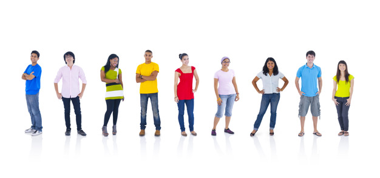
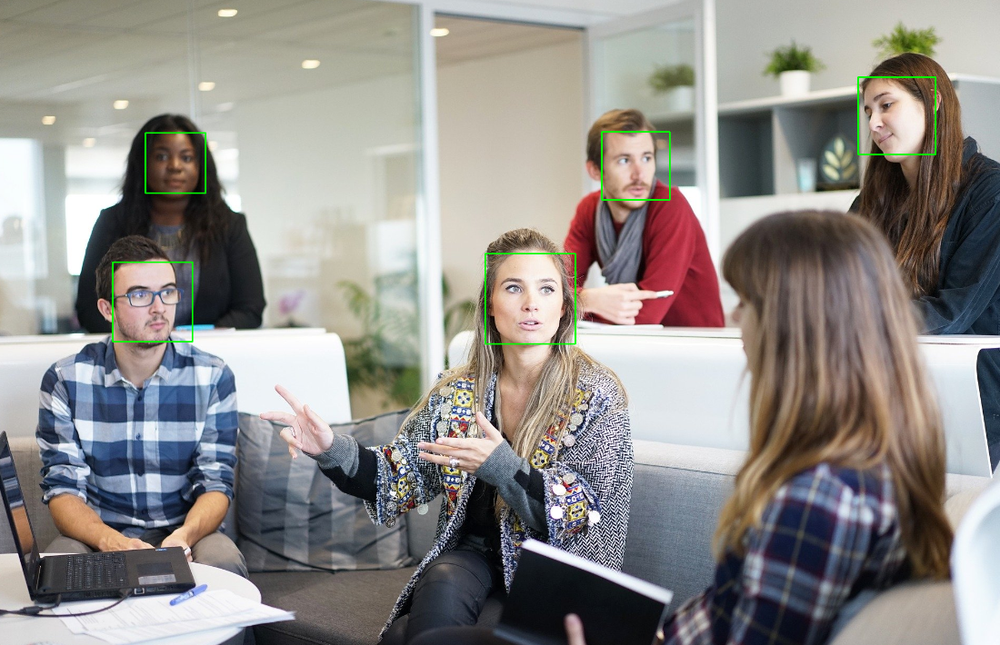

# Detecção de Faces e Corpos usando OpenCV 🧑‍🦰🙍🏻‍♂️

## Descrição 🔎

O estudo faz parte de uma aula do curso "Inteligência Artificial e Machine Learning: O Guia Completo" por Jones Granatyr, disponível na Udemy.

Este projeto implementa a detecção de faces e corpos em imagens usando a biblioteca OpenCV. Utiliza classificadores Haar Cascade para detectar padrões específicos em imagens. Este projeto foi desenvolvido e executado no Google Colab.

## Instalação ⚒️

**Dependências**\
Para executar este projeto, você precisa da seguinte biblioteca Python:

* opencv-python

Você pode instalar a biblioteca usando o seguinte comando:

```python
!pip install opencv-python
```

## Código 🔢
### 1. Importação das bibliotecas:

```python
import cv2
from google.colab.patches import cv2_imshow
```
### 2. Carregamento das imagens (use as de sua preferência🫵🏻):
```python
imagem = cv2.imread('/content/workplace-1245776_1920.jpg')
imagem2 = cv2.imread('/content/pessoas.jpg')
```
<h1 align="center"> 
    <br>
    
    
    <br>
    <br>
</h1>

### 3. Carregamento dos Classificadores Haar Cascade
```python
detector_face = cv2.CascadeClassifier('/content/haarcascade_frontalface_default.xml')
detector_corpo = cv2.CascadeClassifier('/content/fullbody.xml')
```

### 4. Conversão das imagens para tons de Cinza:
* Passo necessário para a implementação do algoritmo.
```python
imgCinza = cv2.cvtColor(imagem, cv2.COLOR_BGR2GRAY) 
# RGB(BGR) para (2 = to) Gray(Cinza)
imgCinza2 = cv2.cvtColor(imagem2, cv2.COLOR_BGR2GRAY)
cv2_imshow(imgCinza)
```
### 5. Detecção de Faces e Corpos:
* Detecção de faces na primeira imagem:

```python
detect = detector_face.detectMultiScale(imgCinza, scaleFactor=1.3, minSize=(30,30))
```
* Detecção de corpos na segunda imagem:
```python
detect2 = detector_corpo.detectMultiScale(imgCinza2, scaleFactor=1.05, minSize=(30,50))
```
### 6. Desenho dos retângulos de identificação

* Desenho de retângulos nas faces detectadas:
```python
for (x, y, l, a) in detect:
    cv2.rectangle(imagem, (x, y), (x + l, y + a), (0,255,0), 2)
cv2_imshow(imagem)
```
* Desenho de retângulos nos corpos detectados:
```python
for (x, y, l, a) in detect2:
    cv2.rectangle(imagem2, (x, y), (x + l, y + a), (0,255,0), 2)
cv2_imshow(imagem2)
```

<h1 align="center"> 
    <br>
    
    
    <br>
    <br>
</h1>

## Considerações finais: 🤓☝️
### **Notas**

* O projeto utiliza arquivos Haar Cascade XML para a detecção de faces e corpos. Esses arquivos são pré-treinados para reconhecer padrões específicos em imagens.
* A imagem de exemplo "workplace-1245776_1920.jpg" é utilizada para a detecção de faces, enquanto "pessoas.jpg" é utilizada para a detecção de corpos.
* A base Haar Cascade fullbody.xml teve dificuldades para detectar a sétima pessoa na imagem "pessoas.jpg", apesar de ajustes nos parâmetros de escala e tamanho mínimo.

## Conclusão ✅:

Este projeto demonstra a aplicação de classificadores Haar Cascade para a detecção de faces e corpos em imagens usando a biblioteca OpenCV. A detecção é feita convertendo as imagens para tons de cinza e aplicando os classificadores treinados para identificar os padrões desejados.

Experimente ajustar os parâmetros scaleFactor e minSize para ver como a precisão da detecção muda. Este projeto pode ser expandido para incluir outros tipos de detecção, como olhos, sorrisos e outros objetos, utilizando classificadores Haar Cascade específicos para cada tipo de detecção.
